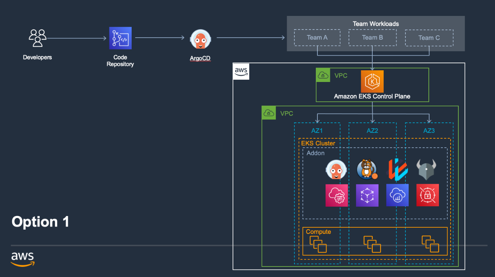
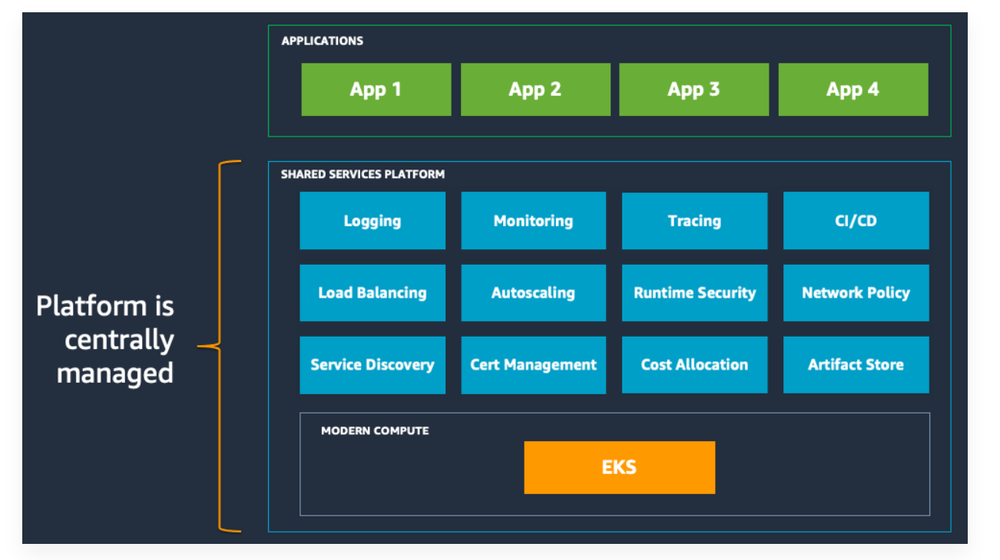

# EKS-Blueprints-for-CDK
## Architecture Diagram

Applications represent the actual workloads that run within a Kubernetes cluster. The framework leverages a GitOps approach for deploying applications onto clusters.

| Concept | Description |
| --- | --- |
| Blueprint | A blueprint combines clusters, add-ons, and teams into a cohesive object that can deployed as a whole. |
| Cluster | An EKS Cluster deployed following best practices. |
| Resource Provider | Resource providers are abstractions that supply external AWS resources to the cluster (e.g. hosted zones, VPCs, etc.). |
| Add-on | Allow you to configure, deploy, and update the operational software, or add-ons, that provide key functionality to support your Kubernetes applications. |
| Teams | A logical grouping of IAM identities that have access to a Kubernetes namespace(s), or cluster administrative access depending upon the team type. |
| Pipelines | Continuous Delivery pipelines for deploying clusters and add-ons. |
| Application | An application that runs within an EKS Cluster. |

## Clusters
A cluster is simply an EKS cluster. EKS Blueprints provide for customizing the compute options you leverage with your clusters. The framework currently supports EC2, Fargate and BottleRocket instances. To specify the type of compute you want to use for your cluster, you supply a ClusterProvider object to your blueprint. The framework defaults to leveraging the EC2ClusterProvider.
